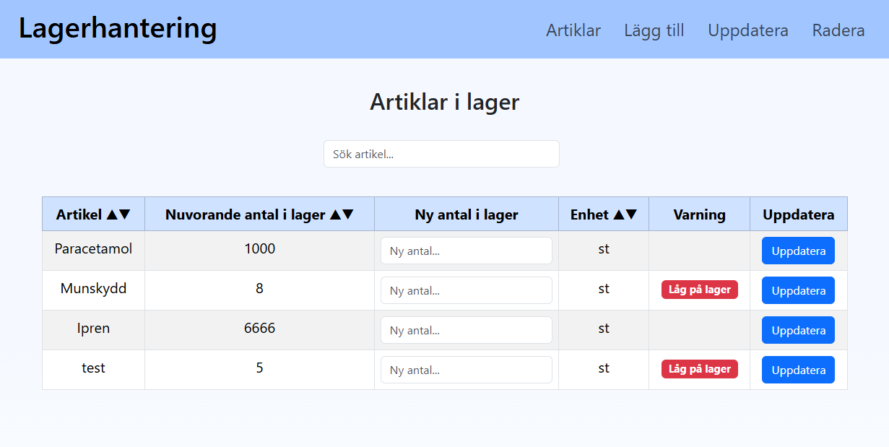

# Inventory Medical App

This project is a web application built with:
- ASP.NET Core Web API as the backend
- React as the frontend

This app is built to manage medical inventory. Users can create new articles, view details of existing ones, delete articles, and update the stock quantity of an article.
The front end validates all inputs to ensure they are in the correct format before sending them to the backend, which stores the data in the database.
The goal of this app is to be user-friendly and intuitive, while minimizing possible user errors by splitting tasks across multiple pages.
To see screenschots of the page plese scroll down...
---

## Database Setup
The backend uses SQLite as the database. To enable it, the following NuGet packages are installed:
- `Microsoft.EntityFrameworkCore.Sqlite`
- `Microsoft.EntityFrameworkCore.Tools`
- `Microsoft.EntityFrameworkCore.Design`

---

## Backend

### Model
- **Article**  
  Defines the structure of an article and serves as the data blueprint.

### Data
- **DbContext** (inside the Data folder)  
  Configures the database connection and manages entity sets.

### Services
- Contains methods for interacting with the database.  
  These services handle the business logic and communicate with the DbContext.

### Controllers
- Receive requests from the client.
- Use the service layer to perform actions.
- Return responses back to the frontend.

### Program.cs
- Configures the application.
- Sets up the database connection.
- Registers controllers and executes their instructions.

---

## Frontend
The frontend is built with React, which communicates with the backend API to display and manage data.
The React app is built using several components, each with its own responsibility. Some components are reused across multiple parts of the app.
All input is validated to ensure the format is correct before communicating with the backend.
All communication is done using JSON, and specific endpoints are used for deleting and updating articles.
---
## Page Screenshots

### Home Page
Displays all articles and allows sorting by multiple columns.  
  

Users can also search for articles using the search box.  
  

### Add New Article Page
Users can add a new article using this page.  
  

When the input is valid and the form is submitted, a success message is displayed.  
  

### Update Quantity Page
Users can update article quantities by entering new values in the table.  
  

Only numerical values are accepted, and they must be zero or positive.  
Clicking **Update** automatically changes the value, and any warning signs are updated accordingly.  
  

### Remove Article Page
Users can remove articles from this page.  
  

Clicking the **Radera** button requires users to confirm their choice.  
Articles can be deleted by selecting them directly in the table or using the search box to find them.  
  

After deleting a row, the table updates automatically.  

